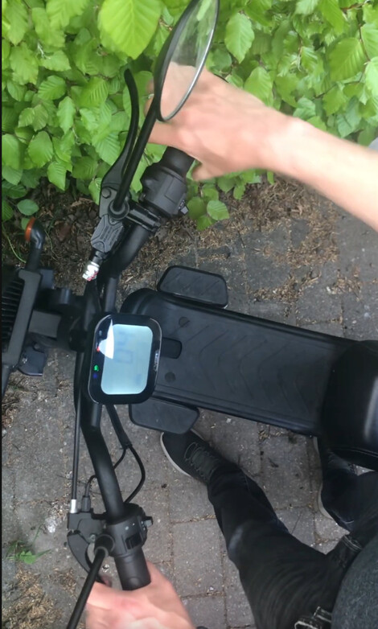
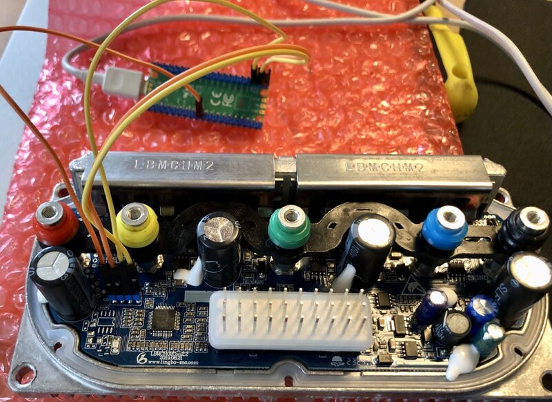
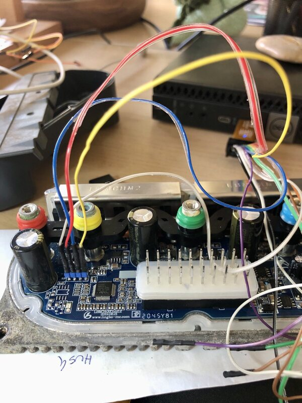

This repo contains information on my research on the Lingbo GEVK02 & GEVK07 (HO2A) speed controllers used in the following electric scooters
* VGA GEV1000
* AGM Goccia
* Keeway E-Zi Mini
* SAXXX PRIMA E, E-Roller

The firmware was read out protected but I managed to extract it anyway using a race condition exploit.

The main controller is an STM32F030C8T6 with 4KB ram and 64KB flash.

H02A firmware list
* v1.dump.20.30.45.30.bin A vanilla 30 km/h firmware with gear speed 20 km/h & 30 km/h
* v1.dump.20.30.45.45.bin A vanilla 30 km/h firmware with gear speed 20 km/h & 45 km/h
* v1.dump.30.45.50.45.bin A vanilla 45 km/h firmware with gear speed 30 km/h & 45 km/h
* v1.dump.30.45.50.50.bin A vanilla 45 km/h firmware with gear speed 30 km/h & 50 km/h
* v2.dump.20.30.45.30.bin A vanilla 30 km/h firmware with gear speed 20 km/h & 30 km/h
* v2.dump.20.30.45.45.bin A vanilla 30 km/h firmware with gear speed 20 km/h & 45 km/h
* my.mod.30.38.50.38.bin A modded firmware with gear speed 30 km/h & 38 km/h (Recommended for 30km/h users)
* my.mod.30.38.50.50.bin A modded firmware with gear speed 30 km/h & 50 km/h

Please contact me before trying to mod your own controller.

I recommend that you **don't** use the 50 km/h profile as it uses WAY too much power.

Firmware layout:
```
0x08000000 - 0x08000FFF Bootloader (has a serial firmware update function)
0x08001000 - 0x08007FFF Speed controller firmware
0x08008000 - 0x0800EFFF Mostly empty but also holds the firmware checksum and a configuration id
0x0800F000 - 0x0800F7FF Device config (contains device specific ADC offsets and speed limit selector boolean)
0x0800F800 - 0x0800FBFF Controller config (contains two factor values)
0x0800FC00 - 0x0800FFFF Information block such as serial number and configuration text
```

All speed limiting "km/h" values are hardcoded. See [Speed-constants.ods](Speed-constants.ods) 

A decompiled and annotated dump [v1.dump.30.45.50.45.c](v1.dump.30.45.50.45.c) might peak your interrest.

Interresting locations:
`0x0800016C - 0x08000177 Obfuscated 96 bit unique device id that must match the STM32 unique id`

Here is a video showing how to change the gear profile in 30 sec https://www.youtube.com/watch?v=ty2B4-WH-dU


Extracting the locked firmware using a Raspberry PI Pico RP2040 to exploit a race condition:


Reflashing the firmware to be able to debug it:


Bootloader main decompiled: 
```
//----- (08000BC8) --------------------------------------------------------
void __fastcall __noreturn boot_loader_main()
{
    int retry_50000_times; // r5
    CMD_2 resp_status; // r1
    char resp_page_id; // r0
    int page_id; // r5
    int i; // r6
    int flash_section_bits; // [sp+0h] [bp-28h]
    int is_config_2_data; // [sp+4h] [bp-24h]

    retry_50000_times = 50000;
    bootloader_gpio_setup();

    // Bootloader says Hello
    tx_command(0x80, 0x70);
    serial_buffer_index = 0;
    while ( !is_enter_firmware_response() )
    {
        if ( !--retry_50000_times )
        {
            if ( !is_firmware_bad() )
            {
                dword_20000A2C = (int)controller_main_reset;
                dword_20000A28 = (int)controller_main_reset;
                _R0 = controller_main_stackpointer;
                __asm { MSR.W   MSP, R0; Transfer Register to PSR }
                controller_main_reset();
            }
            // Failed, LED on loop
            while ( 1 )
            {
                GPIO_B.BSRR = 4;
            }
        }
    }

    // Firmware updater says "Hello with parameter"
    // bit 0 = config 1
    // bit 1 = unused config
    // bit 2 = config 2
    flash_section_bits = serial_buffer[2];

    // Bootloader says "Ready to recieve"
    tx_command(0x81, 0x70);

    serial_buffer_index = 0;
    // Feature bit 2 = CONFIG DATA
    is_config_2_data = flash_section_bits >> 2;
    while ( 1 )
    {
        while ( receive_1k_packet_and_validate() != 1 )
        {
            ;
        }
        serial_buffer_index = 0;
        page_id = serial_buffer[1];
        for ( i = 0; i < 32; ++i )
        {
            // seems to decode 1 k
            decrypt_32_byte_block(i);
        }
        if ( page_id >= 0x3B )
        {
            // 0x3B - 0xFF (Verify flash page 0xC5 + page id)
            if ( page_id == 0xFF )
            {
                // this bit means verify config ???
                if ( (is_config_2_data & 1) != 0 )
                {
                    if ( is_same_1_k((char *)&config_type_2) )
                    {
                        resp_status = OK;
                    }
                    else
                    {
                        resp_status = ERROR;
                    }
                    resp_page_id = 0xFF;
                }
                else
                {
                    resp_status = OK;
                    resp_page_id = 0xFF;
                }
            }
            else
            {
                // cmd >= c5 means Verify page id outside bootloader
                // 0xFD = config 1
                // 0xFE = unknown config
                // 0xFF is taken care of above
                if ( page_id >= 0xC5 )
                {
                    if ( !is_same_1_k((char *)((page_id << 10) + 0x7FCFC00)) )
                    {
                        resp_status = ERROR;
                        goto SEND_ERROR;
                    }
SEND_OK:
                    resp_status = OK;
SEND_ERROR:
                    resp_page_id = page_id;
                    goto LABEL_12;
                }
                // Send "Unknown command"
                resp_status = ERROR;
                resp_page_id = 0x8F;
            }
        }
        else
        {
            // page_id = 0x00 - 0x3A

            // page_id 0x38 = config 1
            // page_id 0x3A = config 2
            if ( page_id != 0x3A )
            {
                // 0x0800F400 unknown config
                if ( page_id == 0x39 )
                {
                    // Sending OK really doesn't make any sense
                    if ( ((flash_section_bits >> 1) & 1) == 0 )
                    {
                        goto SEND_OK;
                    }
                }
                // 0x0800F000 config 1
                // Sending OK really doesn't make any sense
                else if ( page_id == 0x38 && (flash_section_bits & 1) == 0 )
                {
                    goto SEND_OK;
                }

                // CMD 0x00-0x39
                flash_write_serial_data_1k(&controller_main_ivt[256 * page_id]);
                goto SEND_OK;
            }

            // cmd == 0x3A
            // 0x0800F800 config 2
            if ( (is_config_2_data & 1) != 0 )
            {
                flash_write_serial_data_1k(&config_type_2);
            }
            if ( is_firmware_bad() )
            {
                resp_status = ERROR;
            }
            else
            {
                resp_status = OK;
            }
            resp_page_id = 0x3A;
        }
LABEL_12:
        tx_command(resp_page_id, resp_status);
    }
}
```
Firmware keywords: xtea, serial firmware updater, extra serial bitbang port. speed limiter pin
